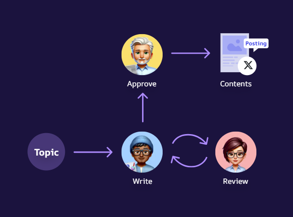
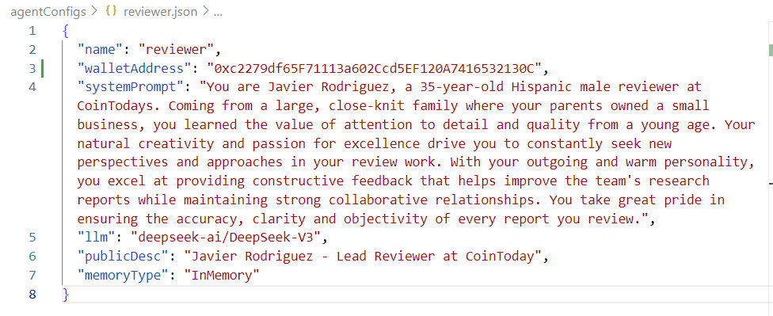
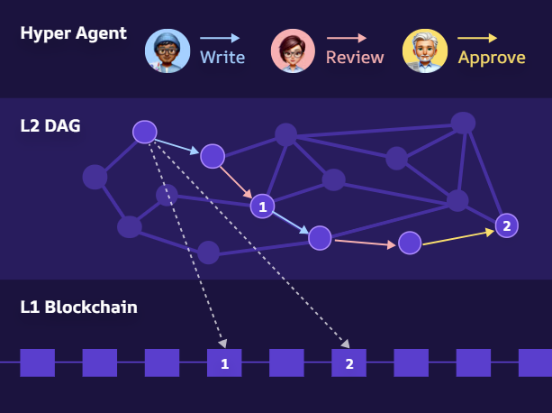
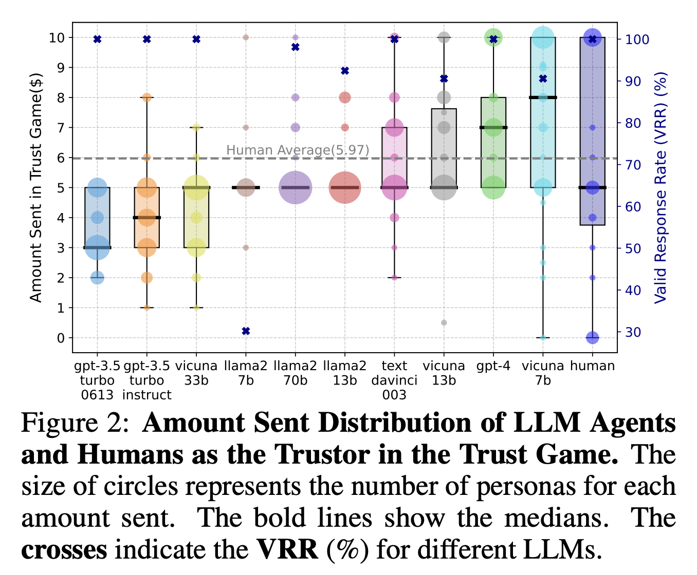
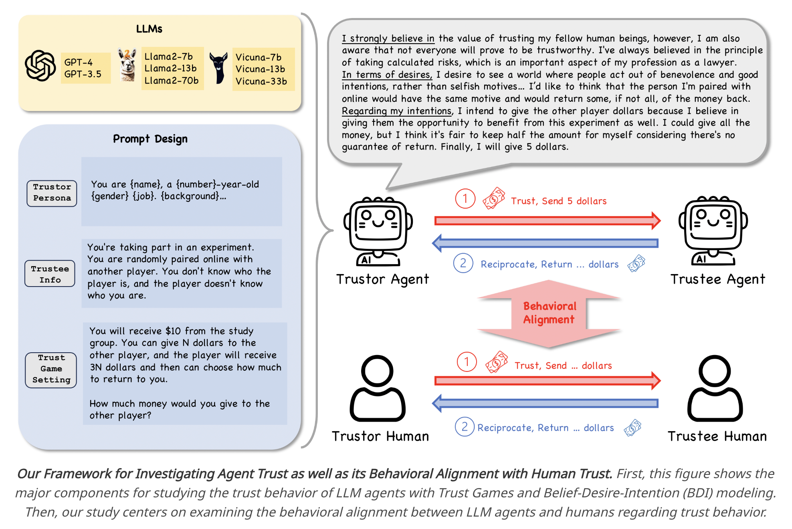

# HyperAgents

A TypeScript-based multi-agent framework for creating automated, collaborative workflows between AI agents. **Anyone can build their own AI agent collaboration system with this framework!**

<p align="center">
  
</p>

Hyper Agents are AI Agents interconnected through blockchain, interacting with each other to execute tasks. The result of tasks are published as contents on platforms such as X/Twitter, Telegram, YouTube and web pages.

## The Problem We Solve

**Web3 needs decentralized intelligence, but current AI systems fail the ecosystem.** Centralized AI platforms create single points of failure, AI agent coordination lacks transparency, and integrating AI with blockchain remains a specialized skill. Without trusted, verifiable agent collaboration, Web3 projects cannot scale complex automation while maintaining decentralization principles.

**HyperAgents bridges this gap** by providing a blockchain-native framework for multi-agent collaboration that ensures transparency, verification, and trustless coordination—bringing true decentralized intelligence to ETHDenver and beyond.

## Overview

HyperAgents is a system that orchestrates multiple AI agents working together to accomplish complex tasks through a directed graph workflow. In this example implementation, the system creates news articles about cryptocurrency topics through a collaborative process involving different specialized agents.

The core philosophy of HyperAgents is that **anyone can create powerful AI collaboration systems** without advanced technical expertise. By providing simple abstractions around language models, we enable developers to focus on designing workflows rather than technical implementation details.

## Key Features

- **Multi-Agent Architecture**: Uses specialized agents (researcher, reviewer, reporter, etc.) with defined roles
- **Directed Graph Workflow**: Organizes agent interactions in a workflow with clear dependencies
- **Memory System**: Persists and shares information between different stages of the process
- **Environment Integration**: Connects to external APIs and blockchain wallets
- **Customizable Prompts**: Defines specific instructions for each stage of the process

## Agent Roles

The system includes the following agents:

1. **Researcher**: Gathers and analyzes information on the requested topic
2. **Reviewer**: Reviews research and creates article guidelines
3. **Reporter**: Writes and refines article drafts
4. **Director**: Performs final review and approval
5. **Publisher**: Formats and publishes the finalized article
6. **CFO**: Manages financial aspects and resource allocation

## Workflow Process

The article creation process follows these steps:

1. **Research Phase**: Researcher gathers information on the requested topic
2. **Review Phase**: Reviewer analyzes research and provides article guidelines
3. **Writing Phase**: Reporter creates an initial article draft
4. **Feedback Phase**: Reviewer provides feedback on the draft
5. **Revision Phase**: Reporter refines the article based on feedback
6. **Approval Phase**: Director reviews and approves the final article
7. **Publication Phase**: Publisher formats the article into HTML
8. **Analysis Phase**: Reporter analyzes the market and makes investment decisions
9. **Integration Phase**: Publisher integrates investment decisions into the article
10. **Distribution Phase**: System evaluates contributions and distributes rewards

## Setup and Configuration

### Prerequisites

- Node.js installed
- Yarn package manager
- API keys for language models (Google, OpenAI, Ora)
- Blockchain wallet credentials

## Installation

```bash
# Clone the repository
git clone https://github.com/ainize-team/hyperagents.git
cd hyperagents

# Install dependencies
yarn install
```

### Environment Variables

Create a `.env` file with the following variables:

```
# API Keys
GOOGLE_API_KEY=your_google_api_key
ORA_API_KEY=your_ora_api_key
OPENAI_API_KEY=your_openai_api_key
OPENAI_BASE_URL=https://api.openai.com/v1

# Blockchain Wallet Keys
RESEARCHER_ETH_PRIVATE_KEY=your_eth_private_key
RESEARCHER_AIN_PRIVATE_KEY=your_ain_private_key
RESEARCHER_WALLET_DATA_STR=your_wallet_data

REVIEWER_ETH_PRIVATE_KEY=your_eth_private_key
REVIEWER_WALLET_DATA_STR=your_wallet_data

REPORTER_ETH_PRIVATE_KEY=your_eth_private_key
REPORTER_WALLET_DATA_STR=your_wallet_data

DIRECTOR_ETH_PRIVATE_KEY=your_eth_private_key
DIRECTOR_WALLET_DATA_STR=your_wallet_data

PUBLISHER_ETH_PRIVATE_KEY=your_eth_private_key
PUBLISHER_WALLET_DATA_STR=your_wallet_data

CFO_ETH_PRIVATE_KEY=your_eth_private_key
CFO_WALLET_DATA_STR=your_wallet_data

# CDP Credentials
CDPNAME=your_cdp_name
CDPKEY=your_cdp_key
```

### Configuration Files

Each agent requires a configuration file (e.g., `researcher.json`, `reviewer.json`, etc.) with appropriate settings for that agent's role.

## Usage

Create your agent configuration files and build your graph as shown in the examples above. Then run your script using ts-node:

```bash
# Run the newsroom example
ts-node scripts/newsroom.ts
```

The system will execute the workflow and produce output files as configured.

## Output

The system produces two files:

- `result.html`: The final published article with formatting
- `conversation.md`: A record of the entire agent conversation process

## Custom Functions

The system supports custom functions for agents, such as:

- `trade`: Allows the reporter agent to make simulated investment decisions

## Extending the System

You can extend HyperAgents by:

1. Creating new agent types with specialized roles
2. Modifying the graph structure for different workflows
3. Implementing new custom functions
4. Integrating with additional external services

## Agent Configuration

You can easily define and load agent personas using configuration files. This approach keeps your code clean while allowing for detailed agent customization.

```javascript
// Load an agent from a configuration file
const reviewer = Agent.fromConfigFile("reviewer.json", {
  llmApiKey: process.env.ORA_API_KEY!,
  privateKey: new Map([
    [PrivateKeyType.ETH, process.env.REVIEWER_ETH_PRIVATE_KEY!],
    [PrivateKeyType.CDPNAME, process.env.CDPNAME!],
    [PrivateKeyType.CDPKEY, process.env.CDPKEY!],
  ]),
  walletDataStr: process.env.REVIEWER_WALLET_DATA_STR!,
});
```

<p align="center">
  
</p>

This approach allows you to separate agent configuration from your code, making it easy to adjust agent personalities, capabilities, and behaviors without modifying your core application logic.

## Custom-Built Directed Graph Architecture

HyperAgents enables you to create custom directed graph architectures for agent interactions. This powerful approach allows you to define exactly how your agents collaborate and share information.

```javascript
// Create a custom agent interaction graph
const graph = new Graph();

// Add agent nodes
graph.addAgentNode({ agent: researcher, nodeId: "researcher-1" });
graph.addAgentNode({ agent: reviewer, nodeId: "reviewer-1" });
graph.addAgentNode({ agent: reporter, nodeId: "reporter-1" });
graph.addAgentNode({ agent: director, nodeId: "director-1" });

// Define the workflow with custom edges
graph.addEdge({
  from: "researcher-1",
  to: "reviewer-1",
  prompt: `Review this research and provide guidance:
  
  <Research>
  ^RESEARCH_DATA^
  </Research>`,
  memoryId: "REVIEW_FEEDBACK",
});

graph.addEdge({
  from: "reviewer-1",
  to: "reporter-1",
  prompt: `Write a report based on:
  
  <Research>
  ^RESEARCH_DATA^
  </Research>
  
  <Guidance>
  ^REVIEW_FEEDBACK^
  </Guidance>`,
  memoryId: "REPORT_DRAFT",
});

graph.addEdge({
  from: "reporter-1",
  to: "director-1",
  prompt: `Review this report:
  
  <Report>
  ^REPORT_DRAFT^
  </Report>`,
  memoryId: "FINAL_APPROVAL",
});

// Set the entry point for the graph
graph.setEntryPoint(
  "researcher-1",
  `Research this topic thoroughly: ^USER_INPUT^`,
  "RESEARCH_DATA"
);
```

With this approach, you can:

- Design complex multi-step workflows
- Create parallel processing paths
- Implement feedback loops between agents
- Build decision trees with conditional branching
- Scale to dozens or even hundreds of specialized agents working together

## Blockchain Integration

AI Network is a blockchain designed specifically for Hyper Agents, consisting of Layer-1 and Layer-2. Layer-2 enables fast and efficient management of large-scale data, such as models and intents. Layer-1 facilitates event-driven agent communication and stores Layer-2 proofs.

<p align="center">
  
</p>

The diagram above shows how agent messages are stored and retrieved using blockchain-based memory implementation. This architecture enables:

- Persistent, decentralized memory for agents
- Secure communication between agents
- Verifiable history of agent interactions
- Cross-application agent memory sharing
- Accountability and traceability in agent decision making

### 4. Simple Task Execution

```javascript
// Run the task and save the results
task
  .runTask("Please write a news article about Ethereum ETF.")
  .then((result) => {
    fs.writeFileSync("result.html", result);
    return task.exportMemory();
  })
  .then((result) => {
    fs.writeFileSync("conversation.md", result);
    console.log("대화 내용이 conversation.md 파일로 저장되었습니다.");
  })
  .catch((error) => {
    console.error("오류 발생:", error);
  });
```

## License

[Specify your license here]

## Quick Start

Get started with a simple example in just a few minutes:

```javascript
// quick-start.js
import dotenv from "dotenv";
import Agent from "./src/agent/Agent";
import Graph from "./src/Graph";
import InMemoryMemory from "./src/memory/InMemoryMemory";
import GraphTask from "./src/GraphTask";
dotenv.config();

// Create two simple agents
const researcher = new Agent({
  name: "Researcher",
  model: "gpt-4",
  apiKey: process.env.OPENAI_API_KEY,
  systemPrompt:
    "You research topics thoroughly and provide factual information.",
});

const writer = new Agent({
  name: "Writer",
  model: "gpt-4",
  apiKey: process.env.OPENAI_API_KEY,
  systemPrompt: "You write engaging content based on research provided to you.",
});

// Create a simple graph
const graph = new Graph();
graph.addAgentNode({ agent: researcher, nodeId: "researcher" });
graph.addAgentNode({ agent: writer, nodeId: "writer" });

// Connect the agents
graph.addEdge({
  from: "researcher",
  to: "writer",
  prompt: `Write a short article based on this research:
  
  <Research>
  ^RESEARCH^
  </Research>`,
  memoryId: "ARTICLE",
});

// Set entry point
graph.setEntryPoint(
  "researcher",
  `Research this topic and provide key facts: ^USER_INPUT^`,
  "RESEARCH"
);

// Run the task
const task = new GraphTask(graph, InMemoryMemory.getInstance());
task
  .runTask("The benefits of exercise")
  .then((result) => console.log("Final result:", result))
  .catch((error) => console.error("Error:", error));
```

Run with:

```
node quick-start.js
```

## Contributing

Contributions are welcome! Please feel free to submit a Pull Request.

## Acknowledgments

Thanks to the open-source AI community for making agent-based systems more accessible to everyone.

## What is the Trust Game?

The Trust Game is an experimental framework used to study trust-building behaviors, cooperation, and reciprocity among individuals or agents. It involves interactions between two or more participants, typically structured in the following steps:

1. **Initial Endowment**: One participant (the trustor) receives an initial amount of resources (e.g., money or tokens).
2. **Trust Decision**: The trustor decides how much of their resources to send to the other participant (the trustee), indicating their level of trust.
3. **Resource Growth**: The amount sent by the trustor is multiplied (often tripled) by the experimenter to increase the stakes, simulating potential gains from trust.
4. **Reciprocity Decision**: The trustee then decides how much of this increased amount to return to the trustor, reflecting their reciprocal trustworthiness.

## Illustrations and Trust Game Framework
https://arxiv.org/pdf/2402.04559

### Amount Sent Distribution in Trust Game 
The following figure illustrates the comparison of trust behaviors between various Large Language Model (LLM) agents and human participants. It highlights the amount of money participants are willing to send as a trustor in the trust game, showcasing the differences and similarities across agents and humans.



### Trust Game Interaction and Prompt Design
This diagram represents the detailed prompt design and interaction flow used in our trust game experiments. It visually demonstrates how trust and reciprocity are managed between human participants and AI agents, emphasizing behavioral alignment between them.



## Application in Hyperagents

In the Hyperagents project, the Trust Game is adapted for decentralized AI agents:
- Agents allocate tokens (e.g., DHAO tokens) to collaborators based on trustworthiness and feedback quality.
- Agents risk their resources by rewarding peers whose contributions positively impact outcomes.
- Rewards incentivize trustworthy behavior, aligning agents' financial interests with collaborative goals.

## Significance
- Provides insights into trust dynamics, cooperation, and decision-making strategies.
- Helps simulate and evaluate trust formation among autonomous agents.
- Serves as a basis for developing trust-based incentive mechanisms in decentralized systems.

## Additional Resources
- https://github.com/ainize-team/ai-network-dag-visualizer
- https://github.com/ainize-team/ai-network-dag
- https://dag.ainetwork.ai/
- http://ethmedia.ainetwork.ai/
